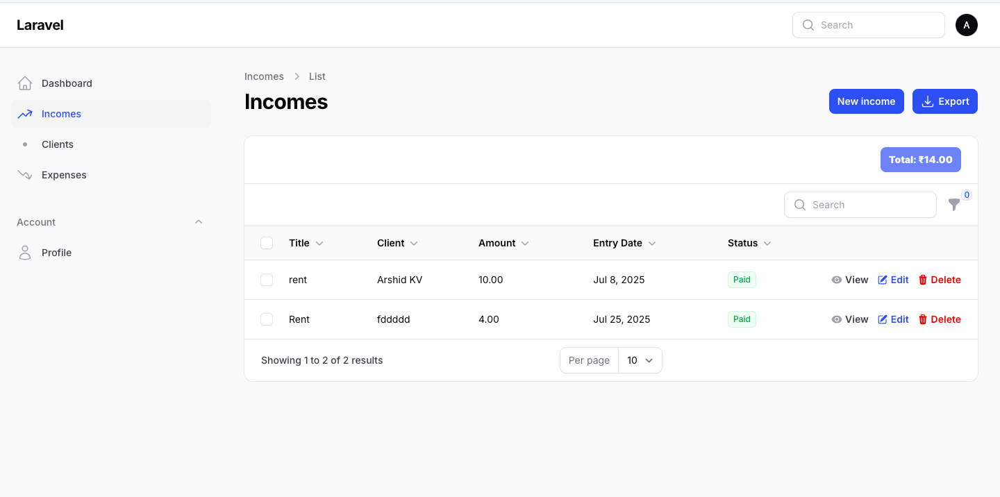

# 📊 Expeezy – Simple & Efficient Expense Tracker

**Expeezy** is a minimal, intuitive expense tracking tool designed to help individuals and small teams manage and export financial data with ease. With built-in support for XLSX export, tracking and sharing your expenses has never been simpler.

---

## 🚀 Features

- ✅ Add, view, and manage daily expenses
- 📂 Organize by category, amount, or date
- 📤 Export expenses to `.xlsx` (Excel-compatible)
- 💡 Clean, responsive interface
- 🔒 Local and secure — your data stays with you

---




## 🛠️ Tech Stack

- Laravel
- Filamentphp

---

## 📦 Installation

1. **Clone the repository:**
   ```bash
   git clone https://github.com/arshidkv12/expeezy.git
   cd expeezy


## 📄 License
This project is open-source and available under the MIT License.


## 🙌 Contributing
Have suggestions or improvements? Feel free to open an issue or submit a pull request.

💬 Questions?
Reach out at arshidkv12@gmail.com